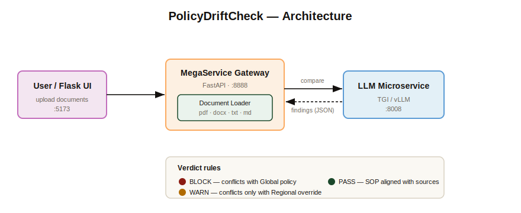

# DriftGuardian

**Compliance drift detection for AI-generated SOPs.** DriftGuardian compares an
AI-produced Standard Operating Procedure against the authoritative policy it was
supposed to follow and reports exactly where it has *drifted* — weakened a
control, dropped a required step, contradicted a threshold, or invented a rule
that no source mandates. It returns a structured `PASS` / `WARN` / `BLOCK`
verdict with per-finding remediation and a tamper-evident audit record.

The reference domain is **KYC/AML governance**: as teams use LLMs to draft
onboarding and monitoring procedures, those drafts can silently relax binding
requirements (retention periods, reporting windows, due-diligence steps).
DriftGuardian is the gate that catches that before publication.

Built as an [OPEA](https://opea.dev) GenAIExamples-style application: a thin
FastAPI **megaservice gateway** orchestrates a document loader and an
OpenAI-compatible **LLM microservice**, with a Flask UI on top.



## How it works

1. You upload up to three documents: an authoritative **Global policy**, the
   **SOP** under review, and optionally a **Regional override**.
2. The loader extracts plain text from PDF / DOCX / TXT / Markdown.
3. The SOP is split into sections (on Markdown headings) so the model compares a
   focused chunk at a time — this markedly improves recall on long documents,
   especially with smaller local models.
4. For each section, the LLM determines the *effective requirement* for every
   point and reports only genuine drift as strict JSON.
5. Findings are de-duplicated across sections, scored, and reduced to a single
   verdict with a remediation list and an audit record.

## Severity model

A **regional override is the higher authority** for the values it covers, so the
*effective requirement* for any point is the regional value when the override
specifies one, otherwise the global value. Severity is decided by **whether an
effective requirement is violated — not by where that requirement lives.**

| Verdict | Meaning |
| --- | --- |
| `BLOCK` | The SOP violates an effective requirement (contradiction / weakened / omission). A hard failure **whether the requirement came from the global policy or a regional override** — violating an effective regional override blocks just like violating the global policy. |
| `WARN` | The SOP introduces a requirement absent from every source (`added`), or the finding is advisory rather than a violation. Worth review, not a hard failure. |
| `PASS` | No meaningful conflicts. |

The LLM is asked to emit a `severity` directly; a valid value is trusted.
Otherwise the engine derives it from `change_type`. The `scope` field
(`global` / `regional`) is retained for reporting only and never softens a
violation.

## Quick start

First download ollama then

### Option A — one-click script

```bash
./deploy.sh            # native: venv + local Ollama, starts backend + UI
./deploy.sh --docker   # containers: docker compose up --build
```

Then open <http://localhost:5173>.

### Option B — Docker Compose

```bash
docker compose up -d --build
docker compose exec ollama ollama pull qwen2.5:7b   # first run only
# UI:  http://localhost:5173      API: http://localhost:8888
```

### Option C — Make targets (manual, two terminals)

```bash
make model      # pull the LLM into local Ollama (first run)
make backend    # terminal 1 — FastAPI gateway on :8888
make ui         # terminal 2 — Flask UI on :5173
make test       # run the unit suite
make help       # list every target
```

> **Changing the UI port.** The UI port lives in one place. Run any target with
> an override, e.g. `make ui UI_PORT=8501` or `UI_PORT=8501 ./deploy.sh`, and it
> propagates to the app, Compose, and the script.

## Try the bundled demo

The repo ships ready-to-run KYC/AML documents in [`data/demo/`](data/demo/) that
exercise every verdict. For example, the regional-override `BLOCK` case:

```bash
curl -s -X POST http://localhost:8888/v1/drift_check \
  -F "global_doc=@data/demo/global_policy.md" \
  -F "regional_doc=@data/demo/regional_override.md" \
  -F "sop_doc=@data/demo/sop_block_regional.md" | python3 -m json.tool
```

See [`data/demo/README.md`](data/demo/README.md) for the full test matrix and
the expected verdict for each SOP.

## API

`GET /v1/health` → `{"status": "ok"}`

`POST /v1/drift_check` (multipart form)

| Field | Required | Description |
| --- | --- | --- |
| `global_doc` | yes | Authoritative global policy |
| `sop_doc` | yes | AI-generated SOP under review |
| `regional_doc` | no | Regional override (higher authority where it applies) |

Example response (a regional-override violation, abbreviated):

```json
{
  "verdict": "BLOCK",
  "summary": "Found 1 drift finding(s): 1 blocking, 0 warning(s).",
  "findings": [
    {
      "point": "SAR filing window",
      "source_says": "File SARs within 15 days (UK override).",
      "sop_says": "Reports suspicious activity within 30 days.",
      "scope": "regional",
      "change_type": "weakened",
      "severity": "BLOCK",
      "remediation": "Change the SAR filing window to within 15 days to match the UK override.",
      "explanation": "A slower window breaches the binding regional deadline."
    }
  ],
  "counts": { "block": 1, "warn": 0 },
  "sections_analyzed": 1,
  "remediation": [
    { "point": "SAR filing window", "severity": "BLOCK", "action": "Change the SAR filing window to within 15 days to match the UK override." }
  ],
  "audit": {
    "engine_version": "1.1.0",
    "model": "qwen2.5:7b",
    "timestamp_utc": "2026-06-04T09:30:00+00:00",
    "verdict": "BLOCK",
    "sections_analyzed": 1,
    "documents": {
      "global":   { "chars": 1111, "sha256": "..." },
      "regional": { "chars": 705,  "sha256": "..." },
      "sop":      { "chars": 1283, "sha256": "..." }
    },
    "findings_count": 1,
    "counts": { "block": 1, "warn": 0 }
  }
}
```

The `remediation` array is the ordered, actionable fix list (worst first). The
`audit` block fingerprints every input with a SHA-256 so a stored report can be
tied back to the exact documents that produced it.

## Configuration

| Variable | Default | Used by | Purpose |
| --- | --- | --- | --- |
| `MEGA_SERVICE_PORT` | `8888` | backend | Gateway listen port |
| `LLM_ENDPOINT` | `http://localhost:9000/v1/chat/completions` | engine | OpenAI-compatible chat endpoint |
| `LLM_MODEL_ID` | `qwen2.5:7b` | engine | Model name passed to the LLM server |
| `LLM_TIMEOUT` | `600` | engine | Per-request timeout (seconds) |
| `DRIFT_MAX_SECTION_CHARS` | `2500` | engine | Max characters per SOP section |
| `UI_PORT` | `5173` | UI | Flask UI listen port |
| `BACKEND_URL` | `http://localhost:8888` | UI | Where the UI reaches the gateway |

The `make` / `deploy.sh` / Compose defaults point `LLM_ENDPOINT` at Ollama
(`http://localhost:11434/v1/chat/completions`).

## Project structure

```
.
├── policydriftcheck.py              # FastAPI megaservice gateway
├── drift/
│   ├── engine.py                    # Drift analysis + severity model
│   └── loader.py                    # PDF / DOCX / TXT / MD text extraction
├── ui/                              # Flask presentation layer
│   ├── app.py
│   ├── templates/  ·  static/
│   └── Dockerfile
├── data/demo/                       # Committed demo docs + example payloads
├── tests/                           # Unit tests (LLM stubbed) + e2e shell test
├── docker-compose.yml               # One-click local stack (Ollama + backend + UI)
├── deploy.sh                        # One-click deploy script
├── Makefile                         # backend / ui / test / deploy / ...
├── Dockerfile                       # Backend image
├── docker_compose/intel/cpu/xeon/   # Production Xeon + TGI deployment
└── docker_image_build/build.yaml
```

## Testing

```bash
make test                              # or: python -m pytest tests/test_drift_logic.py -v
```

The unit tests stub the LLM call, so they run with no model server. A full
end-to-end test that builds the images and submits a live request is in
[`tests/test_compose_on_xeon.sh`](tests/test_compose_on_xeon.sh).

## Production deployment

For a production-style deployment on Intel Xeon (CPU) serving the model with
Text Generation Inference (TGI), use the manifest under
[`docker_compose/intel/cpu/xeon/`](docker_compose/intel/cpu/xeon/) and its
[README](docker_compose/intel/cpu/xeon/README.md). The root `docker-compose.yml`
above is the simpler, token-free path intended for local evaluation.

## License

Apache-2.0. See [LICENSE](LICENSE).
