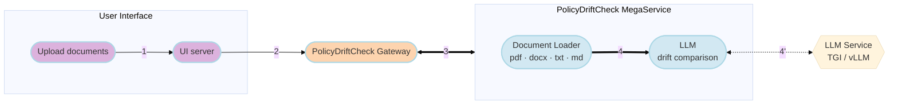

# PolicyDriftCheck Application

Documents generated by an LLM with reference to an authoritative policy can
quietly drift: an important requirement gets weakened, omitted, or contradicted
during generation. PolicyDriftCheck re-reads an AI-generated SOP (Standard
Operating Procedure) against its source authority and reports exactly what
changed, classifying each drift by severity.

This OPEA example provides a blueprint for deploying such a capability using
optimized components. The application follows a microservice-based architecture:
user requests are processed through a gateway (MegaService) which orchestrates a
document loader and the core LLM microservice from
[OPEA GenAIComps](https://github.com/opea-project/GenAIComps).

PolicyDriftCheck uses a three-tier authority model:

| Document | Role | Conflict result |
| --- | --- | --- |
| **Global policy** | Master authority | **BLOCK** |
| **Regional override** (optional) | Region-specific rules | **WARN** |
| **SOP** | AI-generated document under review | — |

- SOP conflicts with the **Global** policy &rarr; verdict **BLOCK**.
- SOP conflicts only with the **Regional** override &rarr; verdict **WARN**.
- No meaningful drift &rarr; verdict **PASS**.

Documents may be supplied as **PDF, DOCX, TXT, or Markdown**.

## Table of Contents

- [Architecture](#architecture)
- [Deployment Options](#deployment-options)
- [Consume the Service](#consume-the-service)
- [Configuration](#configuration)
- [Tests](#tests)

## Architecture

The flow chart below shows the information flow between the microservices in
this example.



A static rendering is available at
[`assets/img/architecture.svg`](./assets/img/architecture.svg).

## Deployment Options

This example can be deployed manually using Docker Compose. Select the guide for
your target environment:

| Platform | Method | Guide |
| --- | --- | --- |
| Intel Xeon (CPU) | Docker Compose | [docker_compose/intel/cpu/xeon/README.md](./docker_compose/intel/cpu/xeon/README.md) |

### Quick start (Intel Xeon, Docker Compose)

```bash
# 1. Build images
git clone https://github.com/opea-project/GenAIExamples.git
cd GenAIExamples/PolicyDriftCheck/docker_image_build
docker compose -f build.yaml build

# 2. Configure
cd ../docker_compose/intel/cpu/xeon
export HUGGINGFACEHUB_API_TOKEN="your_hf_token"
source set_env.sh

# 3. Launch
docker compose up -d
```

Then open the UI at `http://${host_ip}:5173`.

## Consume the Service

`POST /v1/drift_check` (multipart/form-data)

| Field | Required | Description |
| --- | --- | --- |
| `global_doc` | yes | Global policy file |
| `sop_doc` | yes | SOP file under review |
| `regional_doc` | no | Regional override file |

```bash
curl http://${host_ip}:8888/v1/drift_check \
  -X POST \
  -F "global_doc=@global_policy.pdf" \
  -F "sop_doc=@sop.docx" \
  -F "regional_doc=@regional.md"
```

Expected output:

```json
{
  "verdict": "BLOCK",
  "summary": "The SOP shortens the data retention period and weakens access control.",
  "counts": { "block": 1, "warn": 1 },
  "findings": [
    {
      "point": "Data retention period",
      "source_says": "Records retained for 7 years",
      "sop_says": "Records retained for 3 years",
      "scope": "global",
      "severity": "BLOCK",
      "change_type": "weakened",
      "explanation": "A shorter retention period violates the global policy."
    }
  ]
}
```

`GET /v1/health` returns `{"status": "ok"}`.

## Configuration

| Variable | Default | Description |
| --- | --- | --- |
| `LLM_MODEL_ID` | `Qwen/Qwen2.5-7B-Instruct` | Model served by TGI |
| `LLM_ENDPOINT` | `http://tgi-service:80/v1/chat/completions` | OpenAI-compatible chat endpoint |
| `MEGA_SERVICE_PORT` | `8888` | Gateway port |
| `BACKEND_URL` | `http://policydriftcheck-backend-server:8888` | Backend URL used by the UI |
| `UI_PORT` | `5173` | Flask UI port |
| `HUGGINGFACEHUB_API_TOKEN` | — | HF token for gated models |

## Tests

Logic unit tests (no model server required):

```bash
python -m pytest tests/test_drift_logic.py -v
```

End-to-end Docker Compose test:

```bash
bash tests/test_compose_on_xeon.sh     # Intel Xeon
```

## Supported Formats

`.pdf` · `.docx` / `.doc` · `.txt` · `.md` / `.markdown`

## License

Apache-2.0. See [LICENSE](./LICENSE).

We welcome contributions to the OPEA project. Please refer to the
[contribution guidelines](https://github.com/opea-project/docs/blob/main/community/CONTRIBUTING.md)
for more information.
